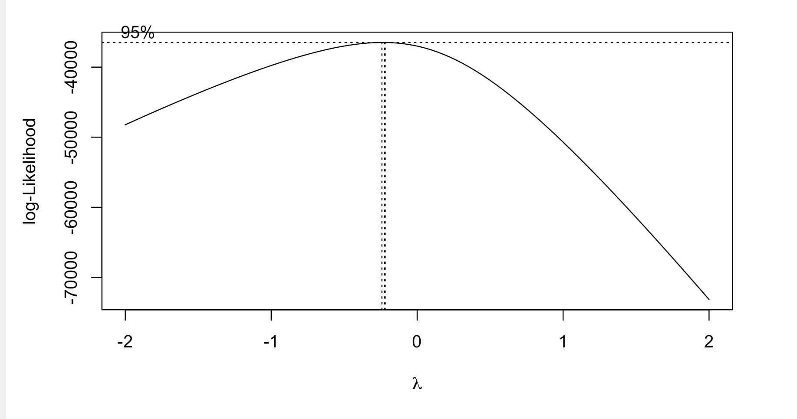
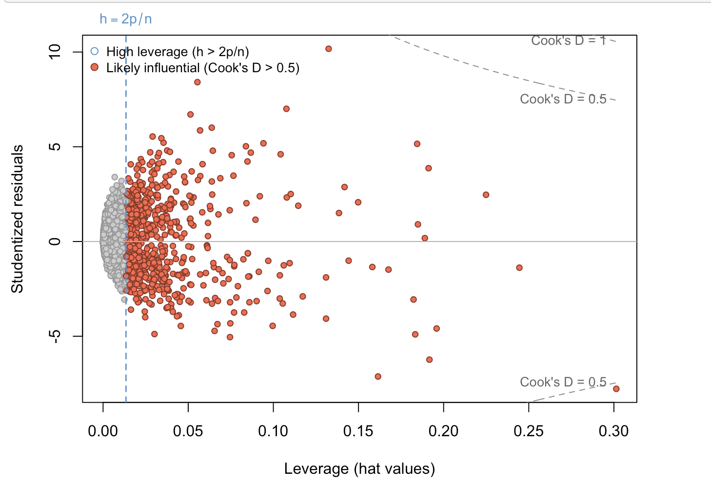
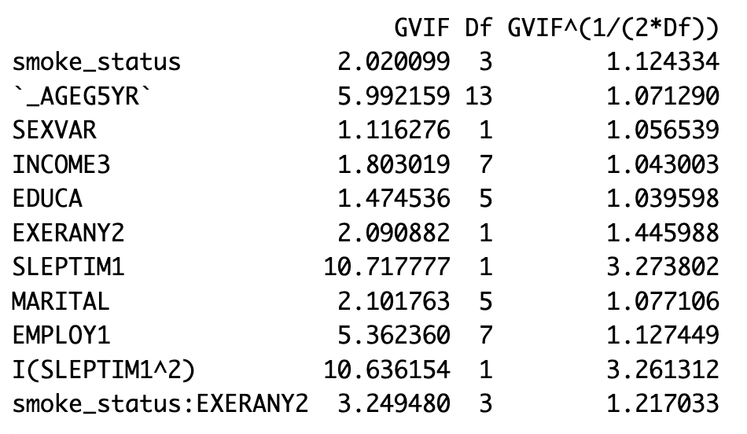

# BRFSS 2022 — Smoking Status & Mental Health (Group Project)

## What this project does
Analyzes the association between **smoking status** and **mentally unhealthy days** using **BRFSS 2022** (U.S. adult survey).

## My contribution
This was a group project. I led the **multivariable modeling and the subsequent diagnostics/interpretation**, including:
- confounder adjustment and model comparison
- weighted analysis (BRFSS survey weight variable used in the report)
- robust inference / diagnostics (e.g., QQ, heteroskedasticity checks, VIF, influence)

## Data
- Source: **BRFSS 2022** (Behavioral Risk Factor Surveillance System).
- Data files are **not included** in this repository. See `data/README.md` for download notes.

## Methods (high-level)
- Outcome: mentally unhealthy days (transformed as needed)
- Exposure: smoking status categories
- Covariates: demographic + lifestyle factors
- Models: multivariable regression with diagnostics and robustness checks

## Key results (2–3 takeaways)
- In univariate analysis, smoking status was associated with mentally unhealthy days: compared with never smokers, former smokers reported +0.72 days, daily smokers +3.13 days, and sometimes smokers +3.24 days (all p < 0.001).
- After multivariable adjustment using a weighted log-linear model with HC3 robust standard errors, the smoking-status term remained significant overall (Type III p ≈ 0.0017). At the coefficient level, only former vs. never was significant (β = −0.384, p ≈ 0.0010), corresponding to about 32% fewer mentally unhealthy days on the original scale.
- Diagnostics improved after log transformation, but heteroskedasticity persisted (motivating robust SE). VIF suggested no serious multicollinearity. The final model had weighted R² ≈ 0.166 (Adj-R² ≈ 0.160).

## Visual highlights
**Choosing a transformation (Box–Cox)**

**Influence diagnostics (leverage & Cook’s distance)**

**Multicollinearity check (VIF)** *(optional)*

## Report
- Live HTML report (GitHub Pages): (to be added)

## Reproducibility (summary)
Open `Report.rmd` and knit the report after placing the BRFSS 2022 data under `data/` (see `data/README.md`).